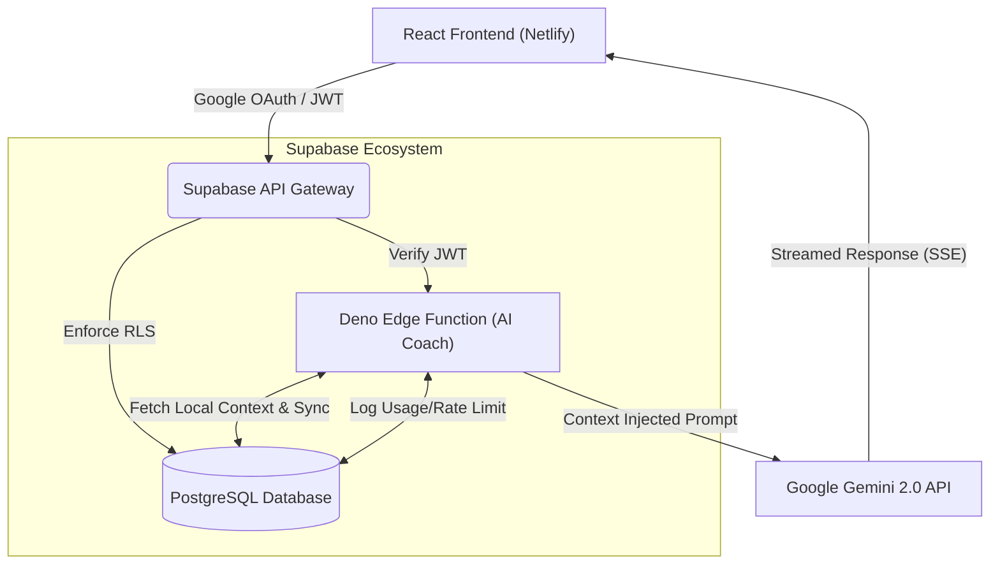

<div align="center">
  
  <br />
  <p><b>A Gamified, AI-Native Productivity Operating System</b></p>

  [](https://haqqat.netlify.app/)
  [](https://reactjs.org/)
  [](https://www.typescriptlang.org/)
  [](https://supabase.com)
  [](https://aistudio.google.com/)
  [](https://tailwindcss.com)
</div>

<br />

**Haqqat** is not just another habit tracker—it is a production-ready, holistic productivity ecosystem. It synthesizes behavioral psychology, robust data analytics, and Gamification with an embedded **Google Gemini 2.0 AI Coach**. 

Designed for high-performance individuals, Haqqat operates flawlessly in production, managing real-world complexities like edge computing, cloud synchronization, intelligent rate limiting, and enterprise-grade authentication.

---

## ✨ Features That Set Haqqat Apart

### 🤖 The Context-Aware AI Coach (Edge Serverless)
Unlike generic chatbots, Haqqat's AI reads your live local data (focus minutes, energy maps, overdue tasks) before replying.
- **RAG / Context Injection:** Your state is fed into the LLM prompt dynamically.
- **Zero-Latency Streaming:** Deno Edge Functions stream the Gemini response via Server-Sent Events (SSE).
- **Cost Management:** Custom DB triggers and UI components (`AILimitGiftBanner`) elegantly handle rate-limiting.

### 🎮 Deep Gamification Engine
- **XP & Levels:** Every completed routine, focus session, and milestone grants XP, triggering beautiful UI celebrations (`Confetti.tsx`, `XPNotification`).
- **Streaks & Multipliers:** Built-in hooks (`useXP`, `useTrack`) calculate productivity scores and streaks in real-time.

### 📊 Behavioral Analytics Suite
Haqqat goes beyond simple task checkboxes:
- **Decision Journal & Procrastination Autopsy:** Track *why* you delay tasks.
- **Energy Map & Life Balance Radar:** Visualize your daily burnout and peak cognitive hours.
- **Weekly Reviews & Future Letters:** Long-term reflective frameworks.

### ☁️ Cloud Sync & Offline Resilience
- **Hybrid State:** Merges lightning-fast local state (`store.ts`) with Supabase PostgreSQL (`cloudSync.ts`) to ensure data is never lost, while maintaining a snappy, offline-first feel.
- **Auth & Pro Gates:** Integrated Google OAuth and email auth, with modular premium feature flagging (`ProGate`).

---

## 🏗️ Architecture & Data Flow

Haqqat leverages a modern decoupled architecture. The frontend is heavily optimized React, while the backend utilizes Supabase for PostgreSQL, Auth, and Edge computing.


*(Note: GenAI API calls are securely proxy-routed through the Deno Edge Function, completely hiding keys from the client while enabling server-side rate limits).*

---

## 🚀 Local Setup & Deployment

Want to run Haqqat locally? It takes less than 5 minutes.

### 1. Requirements
- Node.js 18+ 
- A free [Supabase](https://supabase.com) project
- A free [Google AI Studio](https://aistudio.google.com/apikey) API key

### 2. Configure Database & Edge Functions
1. Run the SQL files in `supabase/migrations/` in your Supabase SQL Editor.
2. Deploy the AI service:
```bash
supabase functions deploy ai-coach
supabase secrets set GEMINI_API_KEY=your_key
```
*(Toggle "Enforce JWT Verification" OFF in the Supabase UI for this function, as it handles its own auth validation).*

### 3. Spin up the Client
Clone the repository, install packages, and create your `.env` (use `.env.example` as a template):
```bash
npm install
npm run dev
```

---

## 💼 Technical Philosophy

For engineers and technical leaders reviewing this repository, Haqqat was built with a philosophy of **pragmatic scaling**:
1. **BaaS Leverage:** Using Supabase eliminated months of DevOps overhead while retaining the raw power of PostgreSQL.
2. **Edge Computing over Node.js:** By placing the AI orchestration layer on Deno Edge functions, the app sidesteps the cold starts and heavy infrastructure of a traditional Express backend.
3. **UX First:** Using Radix UI primitives and Tailwind ensures accessibility without sacrificing aesthetic flexibility, while optimistic UI updates make the app feel instant.

Haqqat is live, tested, and actively used. Check out the [Live App](https://haqqat.netlify.app/)!
