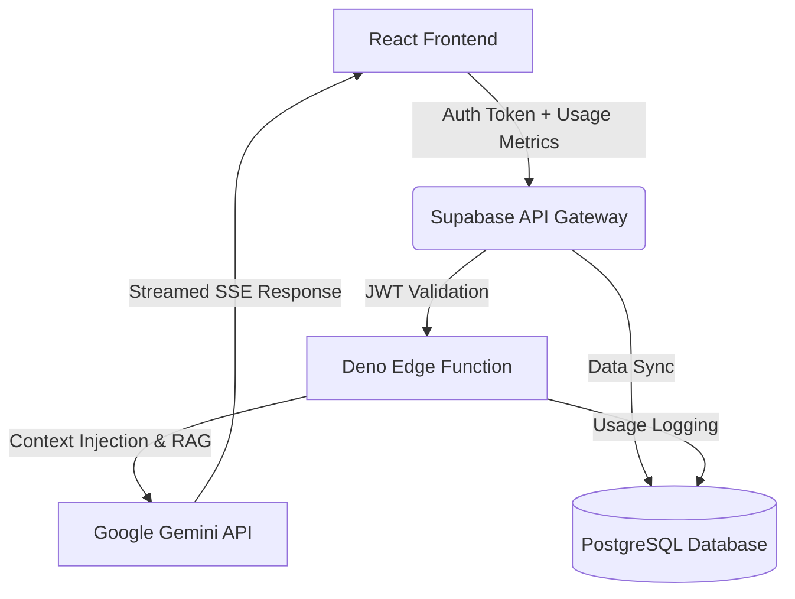

# Haqqat 🚀 | Align · Build · Evolve

[](https://reactjs.org/)
[](https://www.typescriptlang.org/)
[](https://supabase.com)
[](https://aistudio.google.com/)
[](https://tailwindcss.com)

**Haqqat** is a full-stack, AI-powered, gamified productivity ecosystem. Designed to go beyond generic habit trackers, Haqqat contextually understands the user's real-time productivity data and provides hyper-personalized, LLM-driven coaching using Google's Gemini 2.0 Flash Lite via Supabase Edge Functions.

Built independently with scalability and intelligence in mind, Haqqat demonstrates expertise in **Generative AI integration**, **prompt engineering**, **Full-Stack Web Development**, and **serverless edge architectures**.

---

## 🌟 Key Features

### 🧠 GenAI Productivity Coach
- **Context-Aware Inference:** The Gemini-powered AI Coach dynamically ingests user state (focus minutes, task completion, routine streaks) to deliver contextual, non-generic advice.
- **Serverless Edge Computing:** The AI module is securely deployed via Deno-based **Supabase Edge Functions**, ensuring zero cold-start latency and seamless frontend streaming via SSE (Server-Sent Events).
- **Intelligent Prompt Engineering:** Carefully crafted system prompts force the LLM to adopt a "warm, insightful, and action-oriented" persona, avoiding token wastage while maximizing user value.
- **Rate Limiting & Cost Management:** Custom Database/RLS logic tracks and limits AI calls per user to strictly govern API costs in production environments.

### 🎮 Gamified Engine
- **XP & Streaks System:** Custom logic tracking consecutive completion, task difficulty, and focus sessions to award XP dynamically.
- **Productivity Scoring Algorithm:** A weighted algorithm (`calculateDailyProductivityScore`) synthesizing daily logs, overdue tasks, and focus time into a single actionable metric.
- **Rich Data Visualizations:** Integration with modern UI libraries (Radix, Shadcn UI) to render responsive progress bars, data charts, and widgets.

### ⚡ Modern Full-Stack Architecture
- **Frontend:** React 18, TypeScript, Tailwind CSS, Vite (blazing fast HMR).
- **Backend-as-a-Service (BaaS):** Supabase (PostgreSQL) handling robust Authentication, Row Level Security (RLS), and Edge computing.
- **State Management & Caching:** React Query alongside localized store management for offline-first resilience.

---

## 🏗️ Architecture & AI Integration

The core differentiator of Haqqat is its sophisticated AI architecture. Instead of placing the API keys in the client side, all AI inference is securely proxied through edge functions. 



---

## 🚀 Getting Started

### Prerequisites

- Node.js 18+ installed → [Node.js](https://nodejs.org)
- A Supabase project → [Supabase](https://supabase.com)
- A free Gemini API key → [Google AI Studio](https://aistudio.google.com/apikey)

### 1. One-time Supabase Setup
1. Create a project at [Supabase](https://supabase.com).
2. Run database migrations located in `supabase/migrations/` via the SQL Editor.
3. Deploy the AI Coach Edge Function:
   - Navigate to **Edge Functions** and deploy `ai-coach`.
   - Add your `GEMINI_API_KEY` to the Edge Function secrets.
   - **Important:** Toggle "Enforce JWT Verification" to OFF (verification is handled internally in the Deno script).

### 2. Local Environment
1. Clone the repository and install dependencies:
   ```bash
   npm install
   ```
2. Create a `.env` file in the root:
   ```env
   VITE_SUPABASE_URL=https://your-project-ref.supabase.co
   VITE_SUPABASE_PUBLISHABLE_KEY=your-anon-key
   VITE_SUPABASE_PROJECT_ID=your-project-ref
   ```
3. Boot the development server:
   ```bash
   npm run dev
   ```

### 3. Production Deployment
Build the optimized application via `npm run build` and deploy the output `dist/` directory to Vercel, Netlify, or Cloudflare Pages, ensuring environment variables are securely set.

---

## 💼 Why this project? (For Hiring Managers & Recruiters)

I built Haqqat to showcase my capability to engineer real-world **AI-Native applications**. While my primary focus is securing an **AI/GenAI Engineer** or **Machine Learning** role, this project demonstrates my versatility across the stack:
- **LLM/GenAI:** Experience in orchestrating LLM APIs, handling streaming data (SSE), rate-limiting, and prompt context-injection.
- **Backend & Serverless:** Proficiency in writing performant TypeScript backend code in Deno and interacting with PostgreSQL.
- **Full-Stack Software Engineering:** Delivering a polished, responsive, and robust React frontend with modern tooling.

Feel free to explore the codebase, specifically `supabase/functions/ai-coach/index.ts` to see the GenAI integration logic in action. Let's connect!

---

*Haqqat — Built with ❤️ and AI.*
